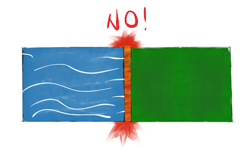
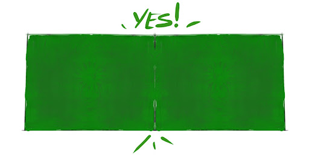
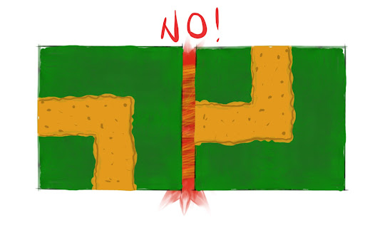
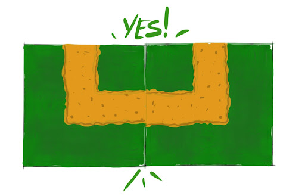

# Game Design Document
## Game Overview
### Introduction
Change your Path is a 2D adventure/puzzle game wrapped around a world altering puzzle mechanic. Change the environment around you to explore the mysterious land, interact with characters and guide Kvothe on his journey.

### Objective
The objective of the game is to find new pieces of map, solve the map puzzle and find the right way to the multiple ends of the story. 
### Feature
* 2D
* Third Person view
* Single player
* Dynamic Map
* NPCs
### Platform
* PC - Windows, MacOS
### Audience
The intended audience is primarily for both casual and non casual gamers since the mechanic is very simple even if it requires reasoning and effort to solve the puzzle. The game does not involve violence or other malicious actions and so it can be played by kids.
### Look and feel
This game should be able to make light-heart a difficult life situation like the one of Kvothe. This is not a perfect and wonderful world made of cheerful colors, fluttering happy little birds and people who are just waiting to help you. However, this is a world full of hope, curiosity and desire to discover what's beyond what you know. The context in which Kvothe is, most of the time should be calm and serene making the player feel like they have plenty of time to solve the next puzzle. Whoever plays is in control of the situation. They must feel free to explore, think, listen and solve.
## Gameplay
### Overview
The gameplay will consist of exploring the world, finding new map pieces, composing the map and moving in new areas.
The gamer will control the movement of Kvothe: he can move right, left, up, down and diagonally. There are no enemies or vertical obstacles, so jump and attack actions aren’t needed. 
The map is divided into square form map pieces.
At the beginning of the game there will be just one square and the player will be able to move only in that limited world portion. In that area will find another map piece that will be connected to the existing square in order to expand the map. The player will visit the new zone and there will find another map piece and so on and so forth. In the map menu all the map squares are movable and rotatable, even the one with the character inside. When moving and rotating the map, every element inside the square will rotate and move accordingly (NPC, Environmental details, objects).
Inside the map square the player can find npc and interactable objects. One type of interactable object is the map piece.
### Minigames
Apart from composing the map in the right way, there will be different minigames. Some of them will be triggered by an interaction of Kvothe with the environment or the NPCs:
* Move a specific square of the map in a well-defined position. For example, an NPC could tell you that it’s home is north of the forest: in the map you have many pieces that could compose a forest, so create it and place the map square where the NPC is inside at north of the forest. This will trigger an event.
* Signs - On one square you find a sign:” At the end of the straight road there is a bridge”. In your existing map there are some map pieces that have a straight road inside, put them in rows from that square and then a new piece with the bridge appears.
* Labyrinth - Consider two identical map pieces that are connectable: the player has to find how to move from one piece to the other in a specific way. For example, some detail in the piece where you stay tells that the similar piece has to be placed on the right. You put the other identical piece on the right and then you have to find on it other information to understand where the previous will be placed with respect to this one. After guessing the combination between the two squares for a certain number of times, the puzzle is solved.
* The player and NPC - Consider not an open area but specific map pieces composed by two tunnels for example: in one tunnel there is the main character, on the other there is the NPC. Your objective is to create the path for you and your friend in order to exit the tunnels. So there are pieces that will allow only you to move because you can connect only your tunnel for example but not the NPC one.
* Don’t get caught - An angry character starts to run to catch Kvothe. The only way you have to let him/her stop is opening the map view when Kvothe and the enemy are on two different map pieces and isolate that character on a piece alone. This will prevent the character from continuing. In fact, as soon as the character is isolated it disappear from the scene and the minigame is considered solved. Instead, while Kvothe is caught the minigame restarts over and over.
* Each map piece has a special object in a corner: merge the pieces in order to fit togheter and create at the center of the maps the special object. That object can be a map or a specific way to arrange the pieces.
### Levels
Change your path is divided in chapters. Each of them consists of completing a discrete objective. A way to change from one level to another can be making Kvothe fall outside the bounds of the map and bring him into a new area.

* Chapter 1: In this chapter Kvothe is inside a snowy environment. This first part of the gameplay will be an introduction about how to use the commands, understand the sounds and visuals and solve the first simple puzzles. There Kvothe will meet Wilem that will trigger the first minigame and also introduces elements of the story. After being rewarded by a new piece of Map, Kvothe continues his exploration solving a little ambiental puzzle composed by 4 pieces and a circula river. After that part, Kvothe arrives at the last tilemap of the snow world, there will be an entrance to a green forest and the change of scene.

* Chapter 2: Kvothe has arrived in a spring environment where new puzzles and challenges must be solved starting from the labyrinth minigame. The player has to find the flowerbed in which flowers, sown in the shape of an arrow, will indicate where to go next. As soon as the labyrinth minigame is solved a new collectable map piece is triggered allowing the player to continue. At this point a "Don’t get caught" minigame (previously defined in this document) is spawn. A border surveillance robot tries to catch Kvothe. When you isolate the robot solving the challenge, remains only one puzzle to solve in the chapter. A road sign encountered along the way will say you to construct a straight road. When you do that Abenty and Denna appears. Talk with them and end the game.

The game has been implemented in order to produce 20 minutes of gameplay, that's the reason why it ends after chapter 2 but more chapters could be easily implemented in a future version allowing Kvothe to continue its journey.

## Controls
### Explorer View
Move | &#8592; | &#8594; | &#8593; | &#8595; 
--- | --- | --- | --- | ---
Interact | Space
Map view | Tab 
Items | W
### Map View
Move | &#8592; | &#8594; | &#8593; | &#8595; 
--- | --- | --- | --- | ---
Pick up/ Put down | Space
Rotate | N | M
Explore view | Tab 
New piece | W
Cancel | Esc 
## Story
### Synopsis
In the distant future, a group of scientists is carrying out a study on the adaptive characteristics of humans: a labyrinth of artificial vegetation is built and a village is founded in the center of it. A series of orphans is sent and kept under observation: from that small group of individuals a real community develops. Unaware of everything, these people are blocked inside the forest. Over time, many try to challenge the labyrinth but no one has ever returned: among the village elders the legend of the one who will save the community from their eternal punishment begins to be born, someone able to change the paths.
Meanwhile, Abenthy is a scientist who has the task of monitoring the evolution of the community but falls in love with a woman inside of it, Denna. His role makes any kind of contact impossible but Abenthy manages to fool the other members of the scientific committee and proposes to integrate himself into the village in order to be able to observe the data of interest more accurately respecting one condition: not to reveal the nature of the experiment for any reason. The scientists accept and give him a compass: through this little object, Abenthy could shape the artificial labyrinth around him and return home safely.
 He finally introduces himself as a stranger from outside the forest and encounters all the people of the community. Despite being aware of the possible consequences, he also meets Denna and their love leads to the birth of a child. Engaged by the feelings, Abenthy describes to the girl the freedom outside the village and the beauty of a whole world to explore. Fooled by their own colleague, the scientists set out to capture the two lovers. Abenthy understands the intention of the scientists and leaves with Denna in the only place where they would never have found them: the labyrinth. 
The newborn son is left in the care of an elderly woman of the village. Before entering the forest with Denna, Abenthy leaves its compass in Kvothe’s cradle hoping that one day he will find freedom.
16 years later our story begins.

### Backstory
Kvothe was born in a small village in the middle of a huge forest but since he was a child he has not been able to observe anything outside his small town: the forest around his village is a labyrinth of vegetation and threats. His parents, in search of the desired freedom, disappeared and never returned, leaving Kvothe alone. Despite this, there is a legend of the country that prophesies: "At the age of 16 a boy will be able to find the path to freedom and truth using his power to shape the world". Kvothe, the boy of the prophecy, is at the entrance of the forest ready to discover the truth about his parents and what exists beyond the forest.
### Narrative devices
Kvothe will meet NPCs who, hoping to get out of the maze, got stuck in the forest. By discussing with them and completing the subquests, the game will explain the background of the story while adding more and more new details. 
Kvothe, during his journey, will find some letters: a trace of the passage of his parents. They will contain the reasons why Abenthy and Denna left their son in the village and tried to face the labyrinth. 
The environment around kvothe could be a narrative device: the protagonist will be able to examine elements of the environment that will give him information on the forest.

### Subplots
* Exploring the labyrinth, Kvothe bumps into a man intent on fishing near a lake. Both amazed to see a human presence, the two get to know each other. The man called Wilem tells his story: his goal within the company was to create outposts in the forest in order to explore it and gradually find an exit. Each month he organized expeditions to expand the known perimeter. However, 16 years ago his sister was lost  into the forest and since that event he wanders in the labyrinth with the intention of finding her, currently he is lost and can no longer find his camp. (First minigame, take Wilem to his house) Wilem is actually the brother of Denna and so the uncle of Kvothe but Wilem has never seen Kvothe since he was a baby so at the end, they do not recognize each other. Wilem will give information on her sister but only at the end the user will understand the link between the NPCs.
## Game Characters
### Character Design
*Kvothe: The Protagonist of this game who was born in a small village in the middle of a huge forest but has not been able to observe anything outside his small town.
### Dialogues
### NPCs

*Abenthy: A scientist who has the task of monitoring the evolution of the community but falls in love with Denna and had a baby with Diana called Kvothe.

*Denna: A villager, meanwhile the mother of Kvothe and Abenthy’s wife. 16 years ago she disappeared in the forest with Abenthy.

*Wilem: A villager, Denna’s younger brother, his goal within the company was to create outposts in the forest in order to explore it and gradually find an exit. However, 16 years ago his sister was lost into the forest and since that event he wanders in the labyrinth with the intention of finding her.

*Old man: Mysterious character living in the forest.

*Old woman: A very kind villager. She has been raising Kvothe.

*Robot: The monitors deployed by scientists in the forest which are mainly used to prevent villagers from entering the forest and restrict villagers’ actions.

*Stella: A 8 years-old girl who is a orphan and living in the village.

*Neil: A 10 years-old black boy who is a orphan and living in the village.

*Ivan: A 10 years-old boy who is a orphan and living in the village.

## World
### Rules
This chapter must be detailed better.

There is no fixed world. The player builds one.
He can do it by fitting together different map pieces (we could call them “tiles”) respecting a very simple rule: continue the landscape.
Each tile has a type on each side.

Types can be: grass, water, snow, ice…. (to decide. The idea is: different types, say 5)
 
The player can fit together only tiles that have the same type on the side on which you are fitting them.For example, you cannot put a grass piece near to a water one:

In addition to that, there could be some paths, for example roads or other pathways.
If this is the case, the player must take it into account, again, simply continuing the landscape.

Obviously there will be pieces with different types on different sides.
We don’t need to consider all the possible combinations because we will build the tiles we need to make the levels. The player can build all he wants, at the end of the story only when he respects the constraints of the levels is important.

### Key locations and style

## Media List
### Interface assets
### Environments
#### Tiles
* Grass
* Forest grass
* Water/Grass
* Forest/Grass
* Path/Grass
### Characters
* Dialogues
### Animation
* Kvothe
* Enviromental elements
* Simple animation for the NPCS 
### Music and sound effects
* Background 
* Steps
* When talking to NPCs
* Interactable object (map pieces on the ground)

## Fixing Bug
* Map movement LORIS --> SOLVED
* Kvothe animation adjustment XUYAN
* Tutorial MARIO --> SOLVED
* Player outside the map LORIS --> Partially SOLVED
* Mouse disappearing ANDREA
* Comprenetation of the sprites (Kvothe with NPC and bushes) LORIS --> SOLVED
* When you walk with kvothe and open the Menu, kvothe is still moving MARIO --> SOLVED
* Stop the conversation sound when Kvothe walk away the NPC (not only when the dialogue ends) ANDREA
* Fix Map Piece3 Colliders
* When you are in map mode, space should be disabled

## To do
* NPC and enivromental animation (XUYAN -> MARIO)
* Better Camer Movement and Introduction of MaxiCollider LORIS --> SOLVED
* Chaneg "New Game" and "Play" ANDREA
* Different colors for the selecter: normal mode, grab mode LORIS --> SOLVED
* Highligths non matchable sides LORIS -->SOLVED
* Save and restore the "index" variable of Tutorial Manager.
* Disable tutorial manager script if index > 8 when load -> MARIO;

deadline 20

## Sprites we need:
* Little blue collectable map animation 
* Grass
* Forest grass
* Water/Grass
* Forest/Grass
* Path/Grass

